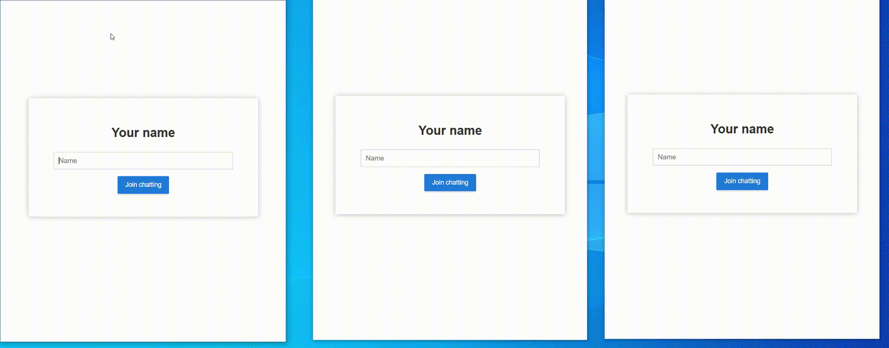

# Spring-Reactive-Chat-Application
(Spring Boot, WebFlux, Reactive WebSocket)


## Index
- [Overview](#Overview) 
- [PreView](#PreView)
- [Features](#Features)
- [Dependencies](#Dependencies)
- [ReactiveStream](#Reactive-Streams)
- [Application Description](#Application-Description)
  - [WebSocket](#WobSocket)
  - [WebPage](#web-page)
  
## Overview
WebSocket & non-blocking 방식의 실시간 채팅 서비스 예제 입니다.

## PreView


## Features
  * 실시간 채팅
  * 채팅 내역 검색 
  * 특정 한도 까지 채팅 기록을 보관 `Sinks.many().replay().limit(1000)`


## Dependencies
* JAVA 17
* Gradle 7.6.1
* Spring Boot 3.0.2
* Spring Webflux
* WebSocket
* lombok


## Reactive Streams
`Reactive Stream`은 비동기(non-blocking) 방식을 제공합니다.

전통적인 동기적 방식(Servlet) 애플리케이션은 요청당 스레드를 생성하는 하여 처리합니다.
만약 요청 처리 시간이 오래 걸리는 IO 작업을 해야 하는 경우, 응답을 기다리는 동안 할당된 스레드는 블로킹 상태에 놓이며 자원의 비효율적 활용이 발생합니다.

반면, 리액티브(Reactive) 애플리케이션에서는 요청을 비동기 이벤트로 처리하고, 이를 공유된 스레드 풀에서 관리합니다.
비동기 방식은 스레드가 작업이 완료되기까지 기다리지 않고, 다른 작업이나 이벤트를 처리 합니다.

리액티브(Reactive) 애플리케이션은 스레드 풀을 적절히 활용하여 컨텍스트 스위칭 비용을 최소화하고, 처리 중인 스레드가 다른 작업을 처리하도록 함으로써 시스템 성능을 최적화할 수 있습니다.


## Application Description
`WebSocket`은 Spring Framework에서 제공하는 `WebSocketHandler`에서는 `WebSocketSession`을 제공 하며

메세지 수신 `send()` 스트림
```
session.send(chatHistory.asFlux()
      .map(this::toString)
      .map(session::textMessage));
```

메세지 발신 `receive()` 스트림
```
session.receive()
    .map(WebSocketMessage::getPayloadAsText)
    .map(this::toEvent)
    .doOnNext(chatEvent -> {
        lastReceivedEvent.set(chatEvent);
        chatHistory.tryEmitNext(chatEvent);
    })
    .doOnComplete(() -> {
        if (lastReceivedEvent.get() != null) {
            lastReceivedEvent.get().setType(ChatEvent.Type.LEAVE);
            chatHistory.tryEmitNext(lastReceivedEvent.get());
        }
    })
    .then();
```
두 개의 Flux 스트림을 연결하였습니다.


### WobSocket
`WebSocket` 연결을 설정하기 위해 `HandlerMapping`과 `WebSocketHandler`를 사용하며, 이를 `WebSocketServerConfig` 클래스에 정의하였습니다.

```
@Bean
public HandlerMapping webSocketMapping(ChatWebSocketHandler webSocketHandler) {
    return new SimpleUrlHandlerMapping(Map.of("/chat", webSocketHandler), -1);
}
```

### Web Page
`resources` 디렉토리에 JS, HTML5, CSS로 구성 하였으며, 웹 페이지를 제공하기 위해, `WebPageRouterConfig`에 정의하여 라우팅 처리를 하였습니다.
```
@Bean
public RouterFunction<ServerResponse> indexRouter(@Value("classpath:/index.html") final Resource indexHtml){
    return  route(GET("/").or(GET("/index.html")),
            request -> ok().contentType(MediaType.TEXT_HTML).bodyValue(indexHtml));
}
@Bean
public RouterFunction<ServerResponse> cssRouter() {
    return RouterFunctions
            .resources("/css/**", new ClassPathResource("css/"));
}
@Bean
public RouterFunction<ServerResponse> jsRouter() {
    return RouterFunctions
            .resources("/js/**", new ClassPathResource("js/"));
}
@Bean
public RouterFunction<ServerResponse> imgRouter() {
    return RouterFunctions
            .resources("/img/**", new ClassPathResource("img/"));
}
```


